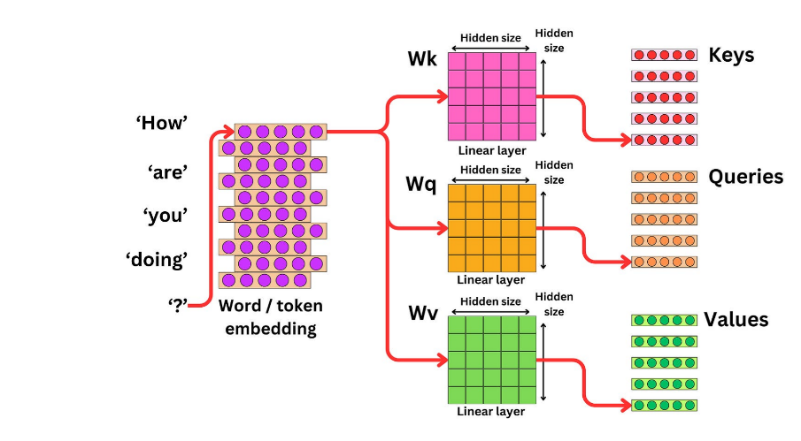

## 🔍 What is Self-Attention?

Self-attention is a mechanism used in Transformer models to allow each word (token) in a sequence to "look at" or **attend to** other words in the same sequence to better understand context. It’s how models like GPT and BERT learn context and meaning.



---

## 🧠 Let’s Use This Example:

> Input sentence: **“How are you doing?”**

---

### ✅ Step 1: Token Embedding

Each word gets converted into a **dense vector** via a word/token embedding layer. So you get 5 vectors — one for each word:
**\[How], \[are], \[you], \[doing], \[?]**

---

### ✅ Step 2: Create Queries (Q), Keys (K), and Values (V)

Each embedded word vector is passed through **three separate linear layers** (just matrices) to create:

* **Query (Q)**: What this word is looking for.
* **Key (K)**: What this word offers to others.
* **Value (V)**: What content it shares with others.

All of these have the same hidden dimension size.

From the image:

* Magenta block → Keys (Wk)
* Orange block → Queries (Wq)
* Green block → Values (Wv)

---

### ✅ Step 3: Calculate Attention Scores

Let’s focus on the word **“How”**.

To understand how much attention **“How”** should give to other words, we:

1. Take the **Query vector for “How”**
2. Dot-product it with **Key vectors of all words** (including itself)
3. This gives us a **score** for each word.

Mathematically:

```
score(how, are) = Q_how · K_are^T
```

Do this for all token pairs in the sequence.

---

### ✅ Step 4: Softmax Scores

These raw scores are passed through a **softmax** to turn them into **weights that sum to 1** (aka attention distribution).

Example for **“How”**:

```
[0.1, 0.2, 0.3, 0.3, 0.1]  → "How" pays 30% attention to "you" and "doing"
```

---

### ✅ Step 5: Multiply with Values

Each word's **Value (V)** vector is multiplied by the corresponding attention score.

So the new **representation of “How”** becomes:

```
Z_how = sum(attention_weights * Value_vectors)
```

Do this for each word in the sequence.

---

## 🎯 Final Output

You now have **new vectors** (Z vectors) for each word that include **contextual information** from other words — all computed in parallel.

---

## 🧪 Real Use-Case Impact

For example, in:

> **"He fed the dog because it was hungry."**

To interpret “it”, the model needs to attend more to “dog” than “he”.
Self-attention allows it to do just that — by assigning higher attention weights to “dog” when evaluating “it”.

---

## Summary of Flow:

```
Input tokens → Embeddings → Q, K, V →
Dot-product(Q, K) → Softmax → Attention Weights →
Attention Weights × V → Contextual Output
```

