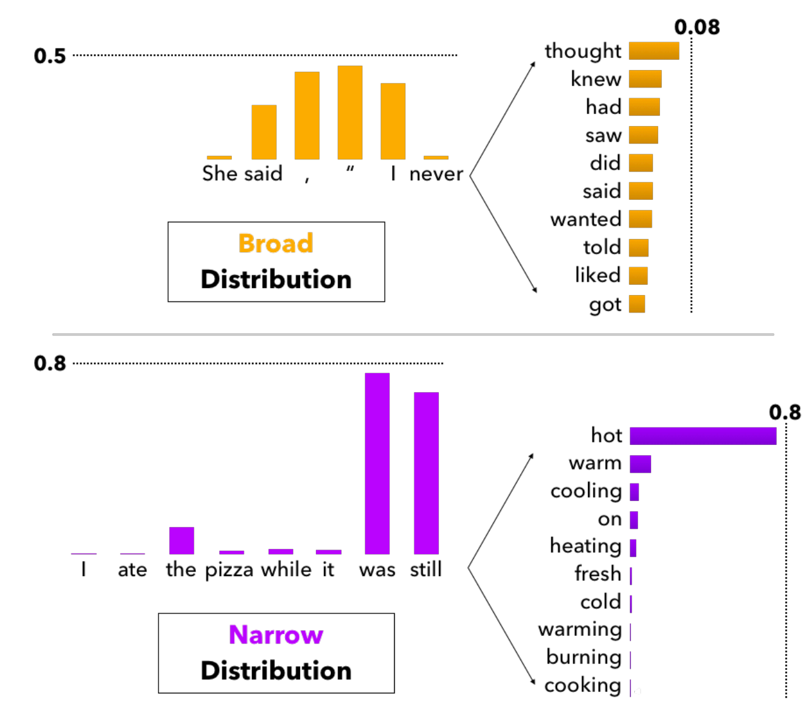

In language models, **temperature**, **top-k**, and **top-p** are parameters that influence the randomness and diversity of generated text. Here's a detailed explanation of each, along with examples:

**1. Temperature:**

The temperature parameter controls the randomness of token selection during text generation. It adjusts the probability distribution of the next token by scaling the logits (raw model outputs) before applying the softmax function.

- **High Temperature (>1):** Flattens the probability distribution, making token probabilities more uniform. This increases the chance of selecting less probable tokens, leading to more diverse and creative outputs.

  *Example:* With a temperature of 2, given the prompt "The sun rises in the", the model might continue with "west" or "ocean," introducing creative but less likely completions.

- **Low Temperature (<1):** Sharpens the probability distribution, making high-probability tokens more dominant. This results in more predictable and coherent outputs.

  *Example:* With a temperature of 0.5, the same prompt might lead to "east," reflecting a more deterministic completion.

- **Temperature of 0:** The model selects the highest probability token at each step, producing the most predictable output.

  *Example:* With a temperature of 0, the prompt "Once upon a" will consistently yield "time."

**2. Top-k Sampling:**

Top-k sampling limits the pool of candidate tokens to the top *k* tokens with the highest probabilities. The next token is then sampled from this restricted set.

- **Top-k = 1:** Equivalent to setting temperature to 0; always selects the most probable token.

  *Example:* For the prompt "The capital of France is", the model will deterministically output "Paris."

- **Top-k = 3:** The model considers the top 3 tokens. Given the prompt "She opened the", the model might choose among "door," "window," or "box," introducing some variability.

**3. Top-p (Nucleus) Sampling:**

Top-p sampling selects tokens from the smallest possible set whose cumulative probability exceeds a specified threshold *p*. This method adapts the size of the candidate pool based on the probability distribution, offering a balance between diversity and coherence.

- **Top-p = 0.9:** The model includes tokens until their cumulative probability reaches 90%. Given the prompt "He dreamed of", the model might choose among "flying," "becoming a musician," or "traveling the world," covering a broad range of plausible continuations.

- **Top-p = 0.3:** The model restricts choices to tokens that quickly accumulate to 30% probability, leading to more conservative outputs.

**Combining Parameters:**

Adjusting temperature in conjunction with top-k or top-p allows fine-tuning of the model's output.

- **High Temperature + Low Top-p:** Encourages creativity while maintaining some coherence.

  *Example:* Temperature at 1.2 and top-p at 0.8 might produce imaginative yet contextually relevant stories.

- **Low Temperature + High Top-k:** Ensures outputs are sensible and relevant, suitable for tasks requiring accuracy.

  *Example:* Temperature at 0.7 and top-k at 50 might be ideal for generating technical explanations.

Understanding and tuning these parameters can help in generating text that aligns with specific requirements, balancing creativity and coherence as needed.

videoUnderstanding Temperature, Top-K & Top-Pturn0search5 

